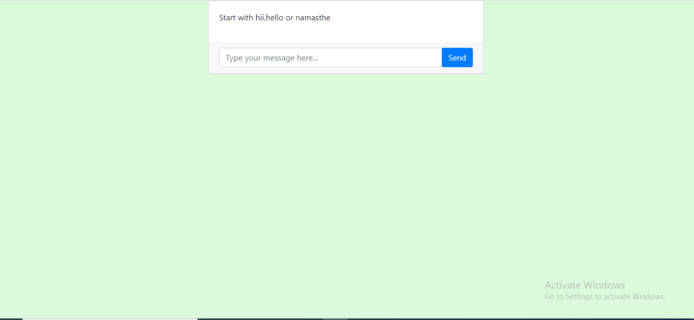

# Website for Covid 19 Chatbot using Php and Mysql
## Designed by
Kommasani Sita Rami Reddy
# Introduction
In previous <a href="https://github.com/Ram-2023/Covid-19-Chatbot">Covid 19 Chatbot</a> ,I already discussed about purpose of creating this bot and how bot works.Now i designed a website for this bot.So people can easily approach and get the information from this website.
# Tools used for designing website
<li>HTML</li>
<li>CSS</li>
<li>PHP</li>
<li>MYSQL</li>

# Website look

# Website demo
https://youtu.be/j5hOvx7FyQM

# Resources referred
https://www.w3schools.com/sql/default.asp

https://www.w3schools.com/php/default.asp

https://youtu.be/F373XvBwoqY

